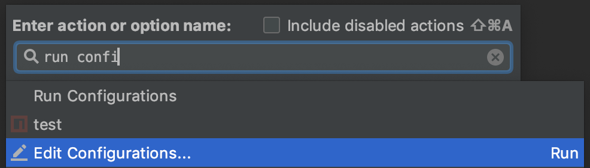
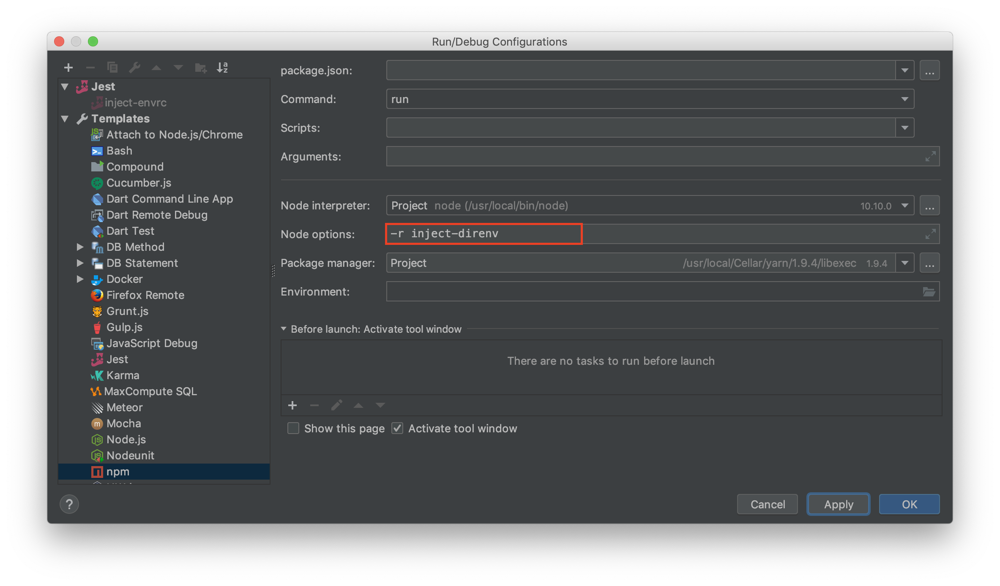

# inject-direnv

find `.envrc`(until root directory) inject export variable
if you are using JetBrain series, You can run IDE Run(`option` + `F11`) with injected `.envrc`

## Install
```bash
npm install -D inject-direnv
```

## Usage

### WebStorm (Intellij)
**Run** Intellij(WebStorm)  
`Ctrl` + `A`




### In code
```javascript
import 'inject-direnv'
```

## Configuration

Default target direnv file is `.envrc`,
you can change with `INJECT_DIRENV_ENVRC` variable

Edit `.envrc.local`

```text
export ENVRC_LOCAL=yes
```

Export `INJECT_DIRENV_ENVRC`

```bash
export INJECT_DIRENV_ENVRC=.envrc.local
```

Load package

```javascript
import 'inject-direnv'

console.log(process.env.ENVRC_LOCAL)
// yes
```

## Basic concept

```bash
vim .envrc
```

save below text
```bash
export INJECT=true
```

*Run* `node` with `-r inject-direnv` option
```bash
node -r inject-direnv
> process.env.INJECT
'true'
```

## License
MIT